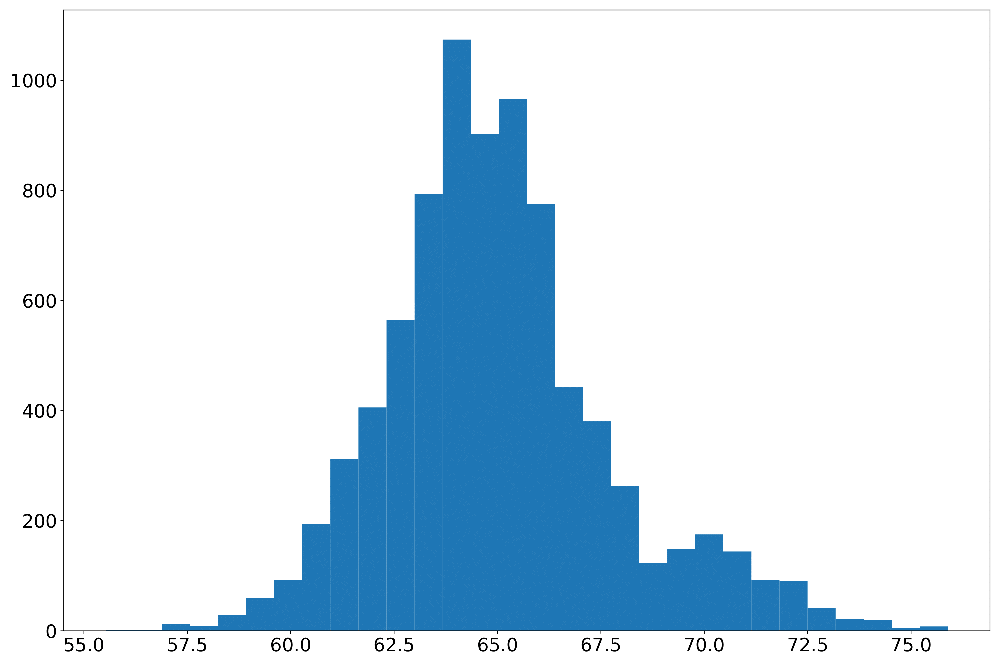
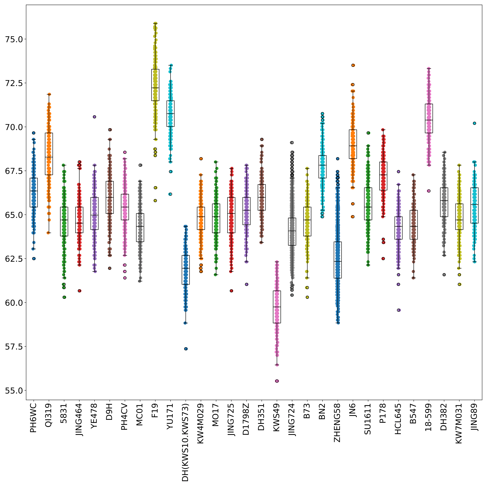
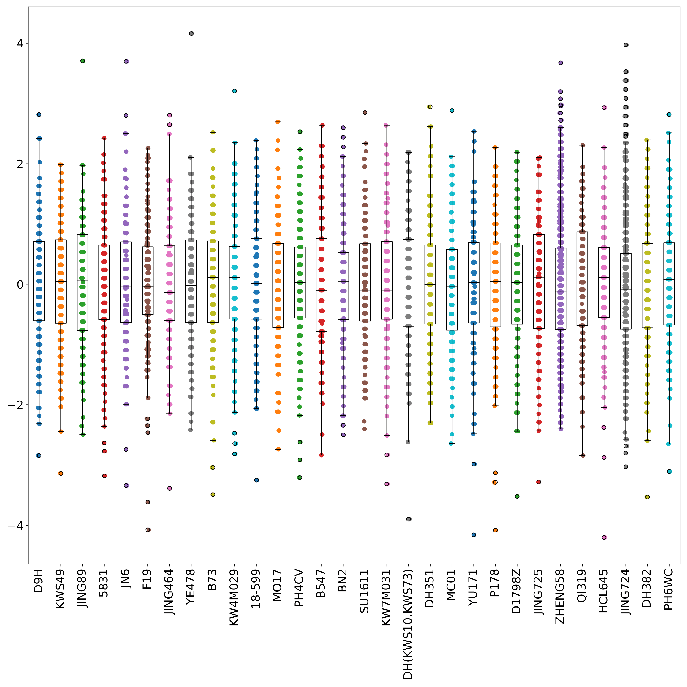
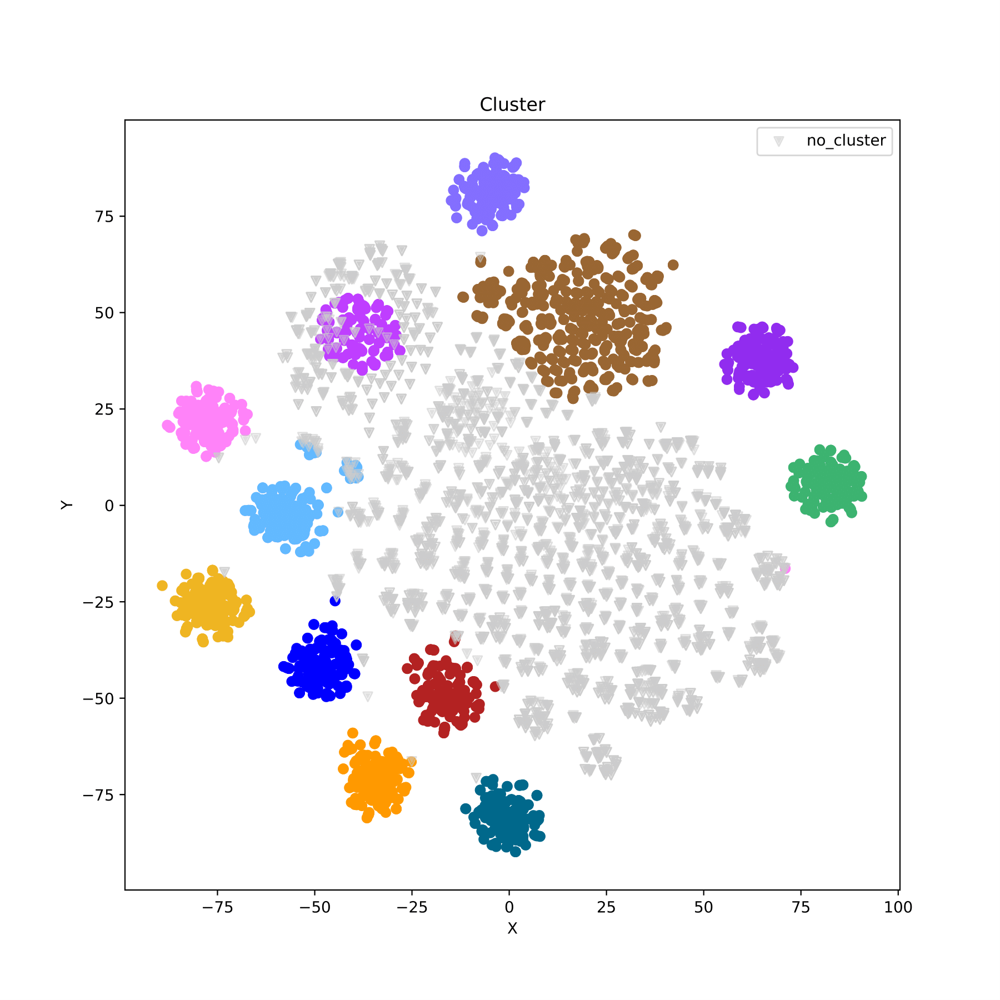
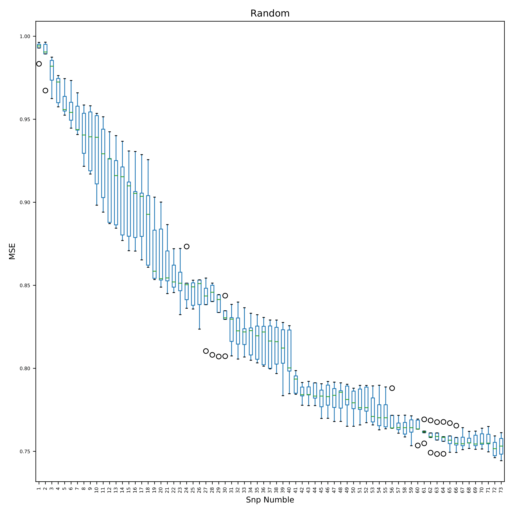

# 详细教程

本节以命令行形式为CropGBM中参数赋值，对程序各功能的实现进行详细介绍并展示部分结果，帮助用户根据研究目的配置相应参数。教程使用的是207个母系和30个父系杂交得到的6210个F1后代的玉米基因组SNP数据，每个样本包含4903个SNP位点，下载地址：[https://github.com/YuetongXU/CropGBM](https://github.com/YuetongXU/CropGBM)  

## 参数配置

CropGBM支持 “配置文件” 与 “命令行” 两种参数赋值形式，其中“配置文件”是必须的。CropGBM会优先读取配置文件中各参数的值，再读取命令行中各参数的值。当某一参数被两种方式同时赋值时，CropGBM以命令行中参数值为参考，忽略配置文件中的参数值。

配置文件是将参数及其对应的值集中在一个文件中，便于用户对大量参数进行统一管理与重复利用。配置文件格式如下：

    [preprocessed_geno]
    # boolean
    phe_norm = false
    phe_plot = true
    
    # necessary
    phefile_path = /home/xyt/GBM_test3/8652.phe
    
    # semi-necessary
    ppgroupfile_path = 
    ppgroupid_column = 
    ppgroupfile_sep =
    
    # optional
    phefile_sep = ' '
    phe_column = 13
    norm_mode = z-score

* `[preprocessed_geno]` 模块名称，其下参数仅在该模块被调用时使用（`[DEFAULT]`模块下参数可在其他模块中被调用）。
* `# boolean` 布尔参数，在配置文件中分为赋值和未赋值两种，在命令行中分为指明和未指明两种。当赋值或指明时，程序将执行参数对应的功能；反之，程序不执行相应功能。
* `# necessary` 必须参数，若参数未赋值，调用模块时会报错。
* `# semi-necessary` 半必须参数，若参数未赋值，调用模块特定功能时会报错。
* `# optional` 可选参数，若参数未赋值，特定功能无法使用，但不会报错。

为方便用户操作，程序解压后包含名为 configfile.params 的配置文件。通过修改配置文件，用户可以快速且大批量的为参数赋值。同时，有默认值的参数在配置文件中已被赋上默认值，如 norm_mode=z-score，用户也可以根据自己的需求更改参数值。当参数值为空、None、false、False时，若参数包含默认值则会使用默认值，否则程序认为此参数未被赋值。  

## 基因型数据预处理

* 根据缺失率、MAF筛除不符合要求的样本个体及snp位点
* 根据高频基因型填补snp的缺失数据
* 根据r^2去除冗余snp
* 基因型数据重编码（基因型 -> 012）
* 根据snp编号或样本编号提取特定样本的特定基因型数据
* 基因型数据的杂合率、缺失率和次等位基因频率分布情况的可视化

CropGBM调用plink完成对基因型数据的部分预处理，为下游分析提供可识别的文件格式及数据。CropGBM会在用户指定的输出路径下创建名为 preprocessed 文件夹，将输出文件统一存放在此目录下。

输入：ped、bed、vcf、bcf格式文件 
输出：filename_filter.bed/bim/fam/ped/map、filename.log/prune.in/.prune.out/frqx/imiss/irem/lmiss、filename_filter.geno、 filename_maf/het/imiss/lmiss.pdf  

### 预处理vcf格式数据

_$ cropgbm -c configfile.params -o gbm_result/ -pg all --fileprefix genofile --fileformat vcf --snpmaxmiss 0.10 --samplemaxmiss 0.10 --maf-max 0.05 --r2-cutoff 0.7_

`-c` 配置文件路径：configfile.params 
`-o` 程序运行结果的输出路径：gbm_result/ 
`-pg` 调用预处理基因型数据模块，可选值 [all, filter]。其中all表示程序将调用完整的预处理模块，包括对统计与可视化数据基本情况，根据缺失率、MAF筛除不符合要求的样本个体及snp位点，根据高频基因型填补snp的缺失数据，根据r^2去除冗余snp，根据snp编号或样本编号提取特定样本的特定基因型数据功能；而filter表示程序将调用部分的预处理模块，仅包括根据snp编号或样本编号提取特定样本的特定基因型数据功能：all 
`--fileprefix` 基因型数据文件名前缀：genofile 
`--fileformat` 基因型数据文件格式，可选值 [ped, bed, vcf, bcf]：vcf 
`--snpmaxmiss` snp最大缺失率。缺失率超过此阈值的snp将被剔除。默认值为 0.05：0.10 
`--samplemaxmiss` 样本最大缺失率。缺失率超过此阈值的样本将被剔除。默认值为 0.05：0.10 
`--maf-max` 最小等位基因频率。最小等位基因频率小于此阈值的snp将被剔除。默认值为 0.01：0.05 
`--r2-cutoff` 与plink中--indep-pairwise参数等价。默认值 0.8：0.7 

输出文件 genofile_filter.bed/bim/fam/ped/map、genofile.frqx/imiss/irem/lmiss/prune.in/prune.out、 filename_maf/het/imiss/lmiss.pdf：

`genofile_filter.bed/bim/fam` bed格式文件，且基因型的编码方式由 ATCG -> 01（其中minor->0，major->1，miss->3），为后续重编码成加性编码做准备。由于plink可以快速读取并处理bed文件，此类文件可以作为生成训练集、测试集、验证集的中间文件。 
`genofile_filter.ped/map` ped格式文件，用于基因型重编码（-> 012），且基因型的编码方式由 ATCG -> 01，为后续重编码成加性编码做准备（其中minor->0，major->1，miss->3）。 
`genofile.frqx` 包含每个snp位点的各基因型数量。 
`genofile_het.pdf` snp杂合率分布直方图。横轴为snp杂合率，纵轴为区间内snp个数。（fig 1） 
`genofile_maf.pdf` snp次等位基因频率分布直方图。横轴为snp最小等位基因频率，纵轴为区间内snp个数。 
`genofile.imiss` 包含各样本的缺失率。 
`genofile_imiss.pdf` 样本缺失率分布直方图。横轴为样本缺失率，纵轴为区间内样本个数。 
`genofile.irem` 包含因缺失率超过阈值而被剔除的样本编号。 
`genofile.lmiss` 包含各snp位点的缺失率。 
`genofile_lmiss.pdf` snp缺失率分布直方图。横轴为snp缺失率，纵轴为区间内snp个数。 
`genofile.prune.in/prune.out` indep后保留（.prune.in）/剔除（.prune.out）的snpid。 
`genofile_plink.log` 程序调用plink时输出的日志文件。 
`genofile_preprocessed.log` 程序调用plink时的标准输出。 

fig 1
  

### 从bed格式文件中提取特定编号的样本、snp数据

_$ cropgbm -c configfile.params -o gbm_result/ -pg filter --fileprefix genofile --keep-sampleid-path ksampleid_file.txt --extract-snpid-path ksnpid_file.txt_

`--keep-sampleid-path` 样本编号文件路径，仅能识别分隔符为空格或制表符的文件，读取前两列数据（第一列为familyID，第二列为within-familyID）。根据文件内的样本编号提取样本：ksampleid_file.txt 
`--extract-snpid-path` snp编号文件路径，根据文件内的snp编号提取snp：ksnpid_file.txt 

_$ cropgbm -c configfile.params -o gbm_result/ -pg filter --fileprefix genofile --remove-sampleid-path rsampleid_file.txt --exclude-snpid-path rsnpid_file.txt_

`--remove-sampleid-path` 样本编号文件路径，仅能识别分隔符为空格或制表符的文件，读取前两列数据 （第一列为familyID，第二列为within-）。根据文件内的样本编号剔除样本：rsampleid_file.txt 
`--exclude-snpid-path` snp编号文件路径，根据文件内的snp编号剔除snp：rsnpid_file.txt 

注意：`-pg filter` 模式下的输入文件仅接受bed格式文件，为将all模式下生成的bed中间文件根据不同要求生成训练集、测试集、验证集等而设计。  

### 重编码bed格式数据

_$ cropgbm -c configfile.params -o gbm_result/ -pg filter --fileprefix genofile --recode --remove-sampleid-path rsampleid_file.txt --exclude-snpid-path rsnpid_file.txt_

`--recode` 将基因型数据的编码方式变为加性编码，变化规则为：00->0, 01->1, 10->1, 11->2

输出文件为 genofile_filter.bed/bim/fam/ped/map/geno：

`genofile_filter.bed/bim/fam/ped/map` 为filter后的输出文件 
`genofile_filter.geno` 为重编码后的输出文件，样本编号为ped文件中的within-familyID  

### 模块参数总体使用

_$ cropgbm -c configfile.params -o gbm_result/ -pg all --fileprefix genofile --fileformat ped --snpmaxmiss 0.10 --samplemaxmiss 0.10 --maf-max 0.05 --r2-cutoff 0.7 --recode --keep-sampleid-path ksampleid_file.txt --extract-snpid-path ksnpid_file.txt_

输出文件为 filename_filter.bed/bim/fam/ped/map、filename.prune.in/.prune.out/frqx/imiss/irem/lmiss、 filename_filter.geno、filename_maf/het/imiss/lmiss.pdf

注意：上述参数除`-c`、`-pg`外均可通过配置文件设定而在命令行中省略  

## 表型数据预处理

* 根据样本编号或组编号提取特定样本表型数据
* 表型数据归一化
* 表型数据分布情况的可视化
* 表型数据重编码（多分类问题）

CropGBM将输出文件统一存放在用户指定保存路径下的 preprocessed 文件夹中。

输入：表型数据，至少包含两列。程序将第一列数据视为样本编号。 
输出：phefile.phe、phefile.phenorm、phefile_groupN.phe、phefile_groupN.phenorm、 phefile.numphe、phefile.wordphe、phefile.word2num、phefile_scatter.pdf、phefile_plotdd.pdf  

### 从表型数据文件中提取特定表型数据并可视化

_$ cropgbm -c configfile.params -o gbm_result/ -pp --phe-plot --phefile-path phefile.txt --phefile-header --phefile-sep ',' --phe-column 2_

`-pp` 调用预处理表型数据模块。 
`--phe-plot` 调用表型数据可视化函数。 
`--phefile-path` 表型数据文件路径：phefile. 
`--phefile-header` 表型数据文件包含表头。 
`--phefile-sep` 表型数据文件分隔符。默认值为 ','：',' 
`--phe-column` 表型数据文件中储存表型信息的列索引，此参数仅当表型文件列数大于2时被调用。默认值为2：2

输出文件为 phefile.phe、phefile_plotdd.pdf：

`phefile.phe` 为提取出的特定表型数据的输出文件。文件总共两列（样本编号，表型值），含表头。 
`phefile_plotdd.pdf` 表型数据分布直方图。横坐标为表型值，纵坐标为数量。（fig 2） 

fig 2
  

### 根据样本编号提取特定样本的表型数据

_$ cropgbm -c configfile.params -o gbm_result/ -pp --phefile-path phefile.txt --phefile-header --phefile-sep ',' --phe-column 2 --ppexsampleid-path ppexsampleid.txt_

`--ppexsampleid-path` 待提取样本编号文件路径，文件内容要求仅为一列样本编号。程序根据文件内样本编号提取表型数据文件中相应样本的表型数据：ppexsampleid.txt

输出文件为 phefile.phe：

`phefile.phe` 为根据样本编号提取特定样本表型数据的输出文件。  

### 根据组编号提取各组样本的表型数据并可视化

_$ cropgbm -c configfile.params -o gbm_result/ -pp --phe-plot --phefile-path phefile.txt --phefile-sep ',' --phe-column 2 --ppgroupfile-path phefile.txt --ppgroupfile-sep ',' --ppgroupid-column 3 --ppgroupfile-header_

`--ppgroupfile-path` 组编号数据文件路径：phefile.txt 
`--ppgroupfile-header` 组编号数据文件文件包含表头. 
`--ppgroupfile-sep` 组编号数据文件分隔符。默认值为 ','：, 
`--ppgroupid-column` 组编号数据文件中储存组编号信息的列索引。该参数仅在 ppgroupfile 列数大于2时使用。默认值为 2：3

输出文件为 phefile_groupN.phe、phefile_scatter.pdf：

`phefile_groupX.phe` 为根据样本的组编号将相同组样本的表型数据提取出的输出文件，其中X为样本的组编号。总共生成N个文件，各文件中仅包含属于组编号X的样本及其表型数据，其中N为样本的组数量. 
`phefile_scatter.pdf` 以散点图和箱线图的形式展示表型数据在各组中的分布情况，横坐标为组编号，纵坐标为表型值，每个点代表一个样本。（fig 3） 

fig 3
  

### 归一化表型数据并可视化

_$ cropgbm -c configfile.params -o gbm_result/ -pp --phe-plot --phefile-path phefile.txt --phefile-sep ',' --phe-column 2 --ppgroupfile-path phefile.txt --ppgroupfile-sep ',' --ppgroupid-column 3 --ppgroupfile-header --phe-norm --norm-mode z-score_

`--phe-norm` 调用表型数据归一化函数。 
`--norm-mode` 归一化算法，可选值 [0-1, max-min, z-score]。默认值 z-score：z-score

输出文件为 phefile_groupN.phenorm、phefile_scatter.pdf：

`phefile_groupX.phenorm` 为根据样本的组编号将相同组样本的表型数据提取出并归一化后的输出文件，其中X为样本的组编号。总共生成N个文件，各文件中仅包含属于组编号X的样本及其表型数据，其中N为样本的组数量 
`phefile_scatter.pdf` 以散点图和箱线图的形式展示归一化后的表型数据在各组中的分布情况，横坐标为组编号，纵坐标为表型值，每个点代表一个样本。（fig 4）

fig 4
  

### 表型数据重编码（多分类问题）

_$ cropgbm -c configfile.params -o gbm_result/ -pp --phe-recode word2num --phefile-path phefile.txt --phefile-sep ',' --phe-column 2_

`--phe-recode` 调用表型数据重编码函数，可选值 [word2num, num2word]。其中word2num表示将表型数据重编码为连续非负整数形式， num2word表示将连续非负整数形式重编码为表型数据（需要提供整数与表型对应转化表）。当执行分类任务时，Lightgbm仅接受带有示例标签[0，N）的连续整数。 如果训练样本来自5组，则需要 [0、1、2、3、4] 作为5组的标签，但这通常与实际的组命名不匹配。使用此参数， 程序可以实现样本标签和[0，N）个连续整数之间的可逆转换。为下游分类任务提供兼容的表型数据：word2num

输出文件为 phefile.numphe、phefile.word2num：

`phefile.numphe` 为表型数据重编码为连续非负整数的输出文件。由于lightgbm在预测分类问题时要求各类别的编码形式为从0开始的连续非负整数，但实际的表型数据很难满足这一要求。程序通过表型数据重编码函数实现上述转换 
`phefile.word2num` 为表型数据与连续非负整数编码方式之间的对应关系文件。

_$ cropgbm -c configfile.params -o gbm_result/ -pp --phe-recode num2word -num2wordfile-path phefile.word2num --phefile-path phefile.txt --phefile-sep ',' --phe-column 2_

`--num2wordfile-path` 整数与表型对应转化表文件路径。该参数仅在`--phe-recode=num2word`时使用：phefile.word2num

输出文件为 phefile.wordphe：

`phefile.wordphe` 为连续非负整数重编码成表型数据的输出文件

注意：重编码功能主要应用于预测分类问题时对表型数据的转化。其中 word2num 常用将训练集样本的表型数据转化为程序可处理的格式，num2word 常用于将测试集的预测结果转化为原表型数据的格式  

## 群体结构分析

* 基于基因型数据分析样本的种群结构

输入：基因型数据 
输出：filename.cluster、filename_redim.pdf、filename_cluster.pdf、filename_reachability.pdf  

### PCA 降维 Kmeans 聚类分析样本群体结构并可视化

_$ cropgbm -c configfile.params -o gbm_result/ -s --genofile-path filename_filter.geno --structure-plot --redim-mode pca --pca-explained-var 0.98 --cluster-mode kmeans --n-clusters 30_

`-s` 调用群体结构分析模块。 
`--genofile-path` 基因型数据文件路径，常为预处理后结果作为输入：filename_filter.geno 
`--structure-plot` 调用群体结构绘图函数。总计输出2（3）幅散点图展示降维与聚类结果。 
`--redim-mode` 降维算法，可选值 [tsne, pca]。默认值 pca：pca 
`--pca-explained-var` 参数值为大于1的整数或0-1间的小数。当参数值为整数时，表示pca降维后数据的维度；当参数值为小数时，表示pca降维后数据可解释的变异量。该参数仅在`--redim-mode=pca`时使用。默认值为 0.95：0.98 
`--cluster-mode` 聚类算法，可选值 [kmeans, optics]。默认值 kmeans：kmeans 
`--n-clusters` 形成的簇数以及生成的质心数。该参数仅在`--cluster-mode=kmeans`时使用：30（因为已知数据集是207个父本与30个母本杂交得到的F1） 

输出文件 filename.cluster、filename_redim.pdf、filename_cluster.pdf：

`filename.cluster` 为聚类结果的输出文件。内容为两列：样本编号、类别。其中类别为 '-1' 表示此样本未被聚类。 
`filename_redim.pdf` 以散点图的形式展现降维结果。（fig 5） 
`filename_cluster.pdf` 以散点图的形式展现聚类结果，不同类别用不同颜色表示。（fig 6） 

 

fig 5

fig 6
  

### t-SNE 降维 OPTICS 聚类分析样本群体结构并可视化

t-SNE 和 OPTICS 降维聚类算法更适用于群体类别数未知的样本，在已知群体类别数的情况下推荐使用 PCA 和 Kmeans 降维聚类算法。

_$ cropgbm -c configfile.params -o gbm_result/ -s --genofile-path filename_filter.geno --structure-plot --redim-mode tsne --window-size 50 --tsne-dim 2 --cluster-mode optics --optics-min-sample 0.025 --optics-xi 0.01 --optics-min-cluster-size 0.03_

`--window-size` 降维中滑窗大小。由于t-SNE降维算法计算速度随维度的增加而大幅降低，程序通过滑窗的方式对数据进行初步降维。在snp数量较少时，参数对降维结果影响较大。建议随着snp数量的降低，相应的减少参数值。默认值为 20。该参数仅在`--redim-mode=tsne`时使用：50 
`--tsne-dim` tsne算法降维后数据的维度。该参数仅在`--redim-mode=tsne`时使用。默认值为 2：2 
`--optics-min-samples` 参数值为大于1的整数或0-1间的小数。当参数值为整数时，表示构成核心点所需的最小样本数； 当参数值为小数时，表示构成核心点所需的最小样本数占总样本数的比例。该参数仅在`--cluster-mode=optics`时使用。默认值为 0.025：0.05 
`--optics-xi` 聚集成类所需的可达距离梯度的最小值。该参数仅在`--cluster-mode=optics`时使用。默认值为 0.05：0.05。 
`--optics-min-cluster-size` 参数值为大于1的整数或0-1间的小数。当参数值为整数时，表示聚集成类所需的最小样本数； 当参数值为小数时，表示聚集成类所需的最小样本数占总样本数的比例。该参数仅在`--cluster-mode=optics`时使用。默认值为 0.03：0.06 

输出文件 filename.cluster、filename_redim.pdf、filename_cluster.pdf、filename_reachability.pdf：

`filename.cluster` 为聚类结果的输出文件。内容为两列：样本编号，类别。其中类别为 '-1' 表示此样本未被聚类。 
`filename_redim.pdf` 以散点图的形式展现降维结果。（fig 7） 
`filename_cluster.pdf` 以散点图的形式展现聚类结果，不同类别用不同颜色表示。（fig 8） 
`filename_reachability.pdf` 以散点图的形式展现各样本间的可达距离，仅在`--redim-mode=tsne`时输出。不同类别用不同颜色表示，离散点用黑色表示。（fig 9） 

 

fig 7

fig 8

fig 9
  

### 比较聚类结果与真实群体关系的差异

_$ cropgbm -c configfile.params -o gbm_result/ -s --genofile-path filename_filter.geno --structure-plot --redim-mode tsne --window-size 50 --tsne-dim 2 --cluster-mode optics --optics-min-sample 0.025 --optics-xi 0.01 --optics-min-cluster-size 0.03 --sgroupfile-path phefile.txt --sgroupfile-sep ',' --sgroupid-column 3 --sgroupfile-header_

`--sgroupfile-path` 组编号数据文件路径：phefile.txt 
`--sgroupfile-sep` 组编号数据文件分隔符：',' 
`--sgroupfile-column` 组编号数据文件中储存组编号的列索引。该参数仅在 --sgroupfile-path 文件列数大于2时使用：3 
`--sgroupfile-header` 组编号数据文件文件包含表头。 

输出文件 filename.cluster、filename_redim.pdf、filename_cluster.pdf、filename_reachability.pdf：

`filename.cluster` 为聚类结果的输出文件。内容为两列：样本编号，类别。其中类别为 '-1' 表示此样本未被聚类。 
`filename_redim.pdf` 以散点图的形式展现降维结果。当参数`--sgroupfile-path`被赋值时，程序将在降维图的基础上标注出各样本的真实标签，不同类别用不同颜色表示。（fig 10） 
`filename_cluster.pdf` 以散点图的形式展现聚类结果，不同类别用不同颜色表示。（fig 11） 
`filename_reachability.pdf` 以散点图的形式展现各样本间的可达距离，仅在`--redim-mode=tsne`时输出。不同类别用不同颜色表示，离散点用黑色表示。 

 

fig 10

 

fig 11
  

## 建模与SNP选择

* 训练模型
* SNP 选择

输入：基因型数据、表型数据 
输出：filename.lgb_model、filename_bygain.pdf、filename_random.pdf、filename_heatmap.pdf

程序允许用户根据研究目的修改lightgbm算法中部分参数。但由于参数较多，本教程没有进行介绍， 相关内容参见：程序参数 > SNP选择与表型预测模块参数 > [lightgbm参数](Parameters.md#lightgbm)  

### 交叉验证

模型训练时，若无验证集帮助判断模型是否过拟合，建议优先通过`-cv`确定合理的训练次数。

_$ cropgbm -c configfile.params -o gbm_result/ -e -cv --traingeno train1.geno --trainphe train1.phe --cv-nfold 5 --min-detal 0.5_

`-e` 调用SNP选择与表型预测模块。 
`-cv` 调用交叉验证功能。 
`--traingeno` 训练集样本基因型数据文件路径。文件分隔符为','，第一行为snp编号信息，第一列为样本编号信息。 该参数在`-t`或`-cv`被指明时使用：train1.geno 
`--trainphe` 训练集样本表型数据文件路径。文件分隔符为','，包含表头，第一列为样本编号信息。该参数在`-t`或`-cv`被指明时使用：train.phe 
`--cv-nfold` 每次交叉验证的折叠数。默认值 5：5 
`--min-detal` 每次训练对模型精确度提升的最小百分值。程序会返回提升的精确度小于此阈值时模型的训练次数与此时模型交叉验证的精确度。当`objective=regression`时，精确度为预测结果与真实值间 mse 的均值。默认值 0.5：0.5  

### 训练模型

_$ cropgbm -c configfile.params -o gbm_result/ -e -t --traingeno train1.geno --trainphe train1.phe --validgeno valid.geno --validphe valid.phe_

`-t` 调用训练模型功能 
`--validgeno` 验证集样本基因型数据文件路径。文件分隔符为','，第一行为snp编号，第一列为样本编号。：valid.geno 
`--validphe` 验证集样本编号文件路径。文件分隔符为','，包含表头，第一列为样本编号：valid.phe

_$ cropgbm -c configfile.params -o gbm_result/ -e -t --traingeno train2.geno --trainphe train2.phe --validgeno valid.geno --validphe valid.phe --init-model-path train1.lgb_model_

`--init-model-path` 起始模型文件路径。lightgbm算法会在此模型基础上继续训练。常用于大数据的分批训练：train1.lgb_model

输出文件：train1.lgb_model

`train1.lgb_model` 为模型文件。记录了每次训练的树结构及每个节点的增益值。

注意：程序通过顺序识别不同的snp，而不以列名。如果两数据集之间相同索引列的snp不同，程序无法识别。所以训练集、测试集、验证集之间snp排序需要一致，否则预测结果无参考性。若训练集与验证集之间相同snp的索引不同，程序会发出警告并对验证集重新排序，使其与训练集相同。但程序没有重排测试集的功能，所以当用户将测试集作为验证集并收到警告时，预测前需重排测试集snp顺序使其与训练集一致。  

### SNP选择

_$ cropgbm -c configfile.params -o gbm_result/ -e -t -sf --bygain-boxplot --traingeno train1.geno --trainphe train1.phe --gain-min 0.05 --colorbar-max 0.6 --cv-times 6_

`-sf` 调用SNP选择功能。该功能被设计为与训练模型功能（`-t`）联用，不可单独使用。 
`--bygain-boxplot` 绘制随snp加入模型误差不断变化的箱线图。该参数在`-sf`时使用。 
`--gain-min` 计算每个snp在模型中的总增益，将最大增益与`--gain-min`的乘积作为阈值。当snp在模型中的总增益小于阈值时，此snp不会被选择。默认值 0.05：0.05 
`--colorbar-max` 各snp在各树中的最大增益值与`--colorbar-max`的乘积将作为热图中 colorbar 的最大值。默认值 0.6：0.6 
`--cv-times` 交叉验证的重复次数。默认值 5：6 

输出文件：train1.lgb_model、train1.feature、train1_bygain.pdf、train1_random.pdf、train1_heatmap.pdf

`train1.lgb_model` 为模型文件。记录了每次训练的树结构及每个节点的增益值。 
`train1.feature` 为SNP增益文件。记录了各snp在每颗决策树中的增益值。 
`train1_bygain.pdf` 以散点图的形式展示随snp的加入，模型误差的变化情况。程序利用已加入的snp在训练集上重复进行 5-fold 的交叉验证。图中x轴坐标为每次模型中新加入的snp编号，按照train1.feature文件中snp的 featureGain_sum 值从大到小依次加入；y轴坐标为预测误差。（fig 12） 
`train1_random.pdf` 以箱线图的形式展示随snp的加入，模型误差的变化情况。图中x轴为模型利用的snp数量，由于每次交叉验证所利用的snp均是重新从全部snp中随机抽取的，故没有snp编号；y轴为预测误差。（fig 13） 
`train1_heatmap.pdf` 以热图的形式展示各snp在不同决策树中的增益值及变化规律，即 train1.feature 文件中的信息。图中x轴坐标为snp编号，按照 train1.feature 文件中snp的 featureGain_sum 值从大到小排列；y轴坐标为决策树编号，编号代表模型的训练次数（如tree20表示第20次训练所生成的决策树）。（fig 14）

 

fig 12

 

fig 13

 

fig 14
  

## 表型预测

* 表型预测

输入：基因型数据、模型文件 
输出：filename.predict

_$ cropgbm -c configfile.params -o gbm_result/ -e -p --testgeno test.geno --modelfile-path train1.lgb_model_

`-p` 调用表型预测功能 
`--testgeno` 测试集样本基因型数据文件路径。文件分隔符为','，第一行为snp编号信息，第一列为样本编号信息。该参数在`-p`被指明时使用：test.geno 
`--modelfile-path` lightgbm模型文件路径，程序通过此模型完成对测试集样本的表型预测。该参数在`-p`被指明时使用：train1.lgb_model

输出文件 filename.predict：

`filename.predict` 为预测结果的输出文件。
